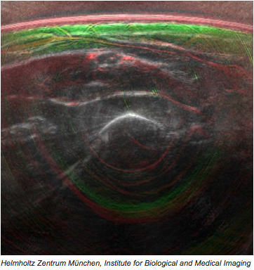

# oa-di-lab

## Enhancement of clinical optoacoustic and ultrasound images

This Project was done in the course TUM Data Innovation Lab in a Team of four students and two supervisors from the Helmholtz Zentrum in Munich.

Students:
Fabian Pieroth, Tom Wollschläger, Eva Höck, Sunita Gopal

Supervisors:
Dominik Jüstel, Jan Kukacka

A detailed documentation of the project is available at:

https://www.di-lab.tum.de/index.php?id=99&L=0

## Abstract

Medical optoacoustic and ultrasound imaging are methods to generate im- ages of tissue types and structures a few centimeters deep inside the tissue. In ultrasound imaging, acoustic ultrasonic waves are emitted and their re- flection at different structures in the tissue is recorded. For the optoacoustic images, short laser pulses are shot at the tissue, which is warmed up by the light absorption. This in turn generates an acoustic sound wave which prop- agates back through the tissue and is recorded. From these recorded signals, the two-dimensional images can be reconstructed under different model as- sumptions, one of which is the model assumed for the speed of the acoustic wave in the various media it passes through (speed of sound model). Low quality images with a very simple, constant speed of sound model can be ob- tained in real time, while higher quality images with a more complex speed of sound model are more computationally intensive. In this project, we present a supervised learning approach to this problem, which is based on Convolu- tional Neural Networks. In the first part (Subproject 1), the task is to map low to high quality images, both reconstructed with the same speed of sound model. Here, the difference between input and target images is mostly noise. We trained a deep Convolutional-Transpose-Convolutional model with skip connections to be able to delete some of the noise while keeping most of the structures in the images. Furthermore, we propose three approaches to reduce the dimensionality of the optoacoustic data. In the second part (Sub- project 2), the target images were reconstructed with a more complex, dual speed of sound model. So, additionally to the denoising, the task was also to learn the translation and deformation due to different speeds of sound. For this, attention masks are employed, which allow to break up the param- eter sharing in convolutional layers. In the original task of Subproject 2, the speeds of sound are arbitrary, which poses a hard problem for a convolutional architecture. Here, we were able to learn the deformation but were not able to keep the details. In a relaxed version of the task, the model is presented with two input images, each one being reconstructed with one of the two speeds of sound assumed for the reconstruction of the target image. In this setting we showed that our model is able to learn the deformation while increasing the image quality. The results show that the deformations are highly dependent on the depth of the image and that the parameter sharing is preventing the network to learn locally different deformations. We further show that pro- viding the network with two input images with the corresponding speeds of sound of the target significantly improves the quality of the prediction.